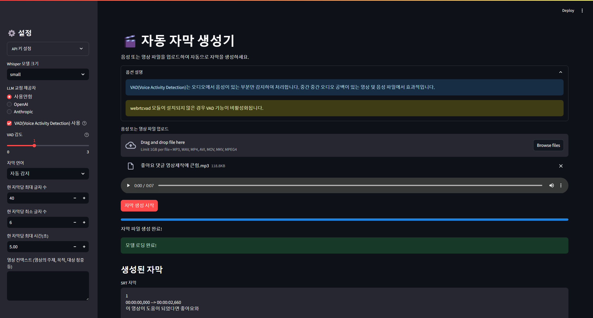

# 자동 자막 생성기 (auto-subtitle-generator)
음성/영상 파일에서 자동으로 자막을 생성하는 파이썬 기반 AI 프로그램으로, LLM을 활용한 영상 컨텍스트 입력 및 자막 교정 기능을 제공합니다.



## 주요 기능

- **다양한 형식 지원**: mp3, wav, mp4, avi, mov, mkv 등 다양한 오디오/비디오 파일 형식 지원
- **다국어 지원**: 한국어, 영어, 일본어, 중국어 등 자동 언어 감지 및 지정 기능
- **AI 교정**: OpenAI 또는 Anthropic Claude API를 활용한 자막 교정 기능
- **VAD(Voice Activity Detection)**: 음성이 있는 부분만 감지하여 처리하는 기능
- **자막 미리보기**: 생성된 자막을 웹 인터페이스에서 바로 확인
- **다운로드 지원**: SRT 및 VTT 형식으로 자막 다운로드

## 설치 방법

### Windows

1. 이 레포지토리를 다운로드 또는 클론합니다.
2. `1. install_windows.ps1` 파일을 실행합니다.
   - PowerShell에서 실행 정책 제한이 있는 경우: `powershell -ExecutionPolicy Bypass -File "1. install_windows.ps1"`
3. 화면의 지시에 따라 설치를 진행합니다.
   - 파이썬이 설치되어 있지 않은 경우 자동으로 설치할 수 있습니다.
   - 필요한 라이브러리가 자동으로 설치됩니다.
   - FFmpeg도 선택적으로 자동 설치할 수 있습니다.

### macOS/Linux

1. 이 레포지토리를 다운로드 또는 클론합니다.
2. 터미널에서 프로젝트 폴더로 이동합니다.
3. 다음 명령을 실행합니다:
   ```bash
   chmod +x "1. install_mac_linux.sh"
   ./1.\ install_mac_linux.sh
   ```
4. 화면의 지시에 따라 설치를 진행합니다.

## 사용 방법

### 실행

- **Windows**: `2. run_windows.bat` 파일을 더블클릭합니다.
- **macOS/Linux**: 터미널에서 `./2. run_mac_linux.sh` 명령을 실행합니다.

실행 후 웹 브라우저가 자동으로 열리며 Streamlit 인터페이스가 표시됩니다. 브라우저가 자동으로 열리지 않는 경우 `http://localhost:8501`로 접속하세요.

### 기본 사용법

1. 사이드바에서 모델 설정 및 자막 생성 옵션을 선택합니다.
2. "파일 업로드" 버튼을 클릭하여 음성 또는 영상 파일을 업로드합니다.
3. "자막 생성 시작" 버튼을 클릭합니다.
4. 자막 생성이 완료되면 SRT 또는 VTT 형식으로 다운로드할 수 있습니다.

### 주요 설정

#### Whisper 모델 크기
- **tiny**: 가장 빠르지만 정확도 낮음
- **base**: 빠르고 기본적인 정확도
- **small**: 적절한 속도와 정확도 (기본 권장)
- **medium**: 높은 정확도, 느린 속도
- **large**: 가장 높은 정확도, 가장 느린 속도

#### LLM 교정 제공자
- **사용안함**: LLM 교정 없이 Whisper 결과 그대로 사용
- **OpenAI**: OpenAI API를 사용하여 자막 교정 (API 키 필요)
- **Anthropic**: Anthropic Claude API를 사용하여 자막 교정 (API 키 필요)

#### API 키 설정
OpenAI 또는 Anthropic을 선택한 경우, "API 키 설정" 확장 메뉴에서 API 키를 입력해야 합니다. 또는 프로젝트 루트 폴더에 `.env` 파일을 생성하고 다음과 같이 API 키를 설정할 수 있습니다:

```
OPENAI_API_KEY=your_openai_api_key_here
ANTHROPIC_API_KEY=your_anthropic_api_key_here
```

#### 자막 옵션
- **자막 언어**: 자동 감지 또는 한국어, 영어, 일본어, 중국어 중 선택
- **최대/최소 글자 수**: 한 자막당 표시할 최대/최소 글자 수
- **최대 시간**: 한 자막당 최대 지속 시간 (초)
- **VAD(Voice Activity Detection)**: 음성이 있는 부분만 감지하여 처리 (긴 파일에 유용)

## 시스템 요구사항

- **운영체제**: Windows, macOS, 또는 Linux
- **Python**: 3.8 이상 (3.10 권장)
- **디스크 공간**: 최소 2GB (Whisper 모델 크기에 따라 증가할 수 있음)
- **RAM**: 최소 4GB (large 모델 사용 시 8GB 이상 권장)
- **인터넷 연결**: 초기 설치 및 LLM API 사용 시 필요

## 문제 해결

### 일반적인 문제

1. **"Python is not recognized as an internal or external command"**
   - Python이 PATH에 추가되지 않았습니다. Python을 재설치하고 "Add to PATH" 옵션을 선택하세요.

2. **패키지 설치 오류**
   - 인터넷 연결을 확인하세요.
   - 방화벽이나 프록시가 설치를 차단하지 않는지 확인하세요.
   - 관리자 권한으로 실행해보세요.

3. **CUDA 관련 오류**
   - 리눅스에서 CUDA 오류가 발생할 경우: `pip install torch torchvision torchaudio --index-url https://download.pytorch.org/whl/cpu` 명령으로 CPU 버전의 PyTorch를 설치하세요.

4. **웹브라우저가 자동으로 열리지 않는 경우**
   - 브라우저를 수동으로 열고 `http://localhost:8501` 주소로 접속하세요.

5. **"Module not found" 오류**
   - 프로그램 폴더로 이동하여 설치 스크립트를 다시 실행하세요.

### LLM 교정 관련 문제

1. **"API key not provided" 오류**
   - API 키가 올바르게 입력되었는지 확인하세요.
   - OpenAI 또는 Anthropic 계정에 잔액이 있는지 확인하세요.

2. **자막 교정이 느린 경우**
   - OpenAI, Anthropic 등 LLM API 서버 요청이 많아 느린 경우가 대다수입니다.
   - 자막 길이를 짧게 설정하여 시도해보세요.

## 주의사항

- 매우 긴 오디오 파일(1시간 이상)은 처리에 시간이 많이 소요될 수 있습니다.
- LLM 교정 사용 시 API 사용 비용이 발생할 수 있습니다.
- Whisper 모델은 첫 실행 시 다운로드되므로 인터넷 연결이 필요합니다.

## 라이센스

이 프로젝트는 MIT 라이센스 하에 배포됩니다. 자세한 내용은 LICENSE 파일을 참조하세요.

## 기여

이슈 및 풀 리퀘스트를 환영합니다. 기여하기 전에 이슈를 통해 변경 사항을 논의해주세요.
